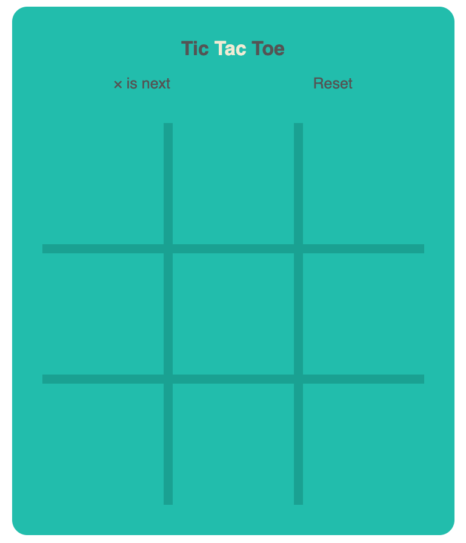

# Tic Tac Toe
## Using only HTML + CSS + JS
 
   
   It's play time, people!
Many kids initial fascination with computers, like that of nerdy kids, had to do with computer games. They were drawn into the tiny simulated worlds that they could manipulate and in which stories (sort of) unfolded—more, I suppose, because of the way they projected their imagination into them than because of the possibilities they actually offered.
I don’t wish a career in game programming on anyone. Much like the music industry, the discrepancy between the number of eager young people wanting to work in it and the actual demand for such people creates a rather unhealthy environment. But writing games for fun is amusing.
In this milestone, you are going to create one of the following grid games.
We will use the browser DOM to display the game, and we’ll read user input by handling key events.

# Tic-tac-toe
  
     Tic-Tac-Toe is about Os and Xs or noughts and crosses . 
     The rule of the game is very simple. On a 3x3 grid, a player has to match 3 consecutive Os or 
     Xshorizontally/vertically/diagonally. play the game  
        
